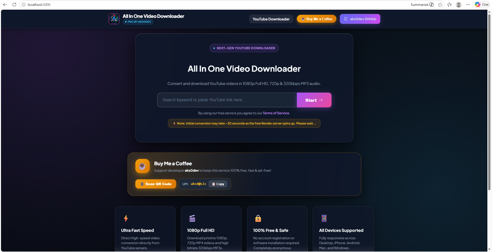

<div align="center">
  
  <h1>🎬 All In One Video Downloader</h1>
  <p><strong>Popular Free YouTube Video & Audio Downloader Web Application</strong></p>

  <p>
    <a href="https://all-in-one-video-downloader-teot.onrender.com" target="_blank">
      
    </a>
    <a href="https://github.com/aks0dev/all-in-one-video-downloader">
      
    </a>
    <a href="LICENSE">
      
    </a>
  </p>

  <p>
    <a href="#-key-features">Key Features</a> •
    <a href="#-screenshot">Screenshot</a> •
    <a href="#-quick-start">Quick Start</a> •
    <a href="#-deployment">Deployment</a> •
    <a href="#-tech-stack">Tech Stack</a>
  </p>

  ---
</div>

## 🌐 Live Application

👉 **Try it Live**: [https://all-in-one-video-downloader-teot.onrender.com](https://all-in-one-video-downloader-teot.onrender.com)

> ⚡ **Note**: Free cloud instances on Render spin up in ~30 seconds on initial load.

---

## 🖼️ Screenshot

<div align="center">
  <br>
  <em>Figure 1: High-Definition Video & Audio Format Selection Interface</em>
</div>

---

## ✨ Key Features

- **⚡ Real-Time Progress Bar & Counter**: Download buttons visually transform into animated progress bars with a real-time `1%` to `100%` counter powered by Server-Sent Events (SSE).
- **🎬 1080p Full HD Video Downloads**: High-definition video processing (1080p, 720p, 480p, 360p, 240p) using `yt-dlp` and `FFmpeg` audio/video merging.
- **🎵 High Bitrate Audio Extraction**: Convert YouTube videos into 320kbps, 256kbps, 128kbps MP3 audio and native M4A streams.
- **🔍 Search & Instant Autocomplete**: Built-in YouTube keyword search engine and real-time autocomplete suggestions.
- **☕ Buy Me a Coffee UPI Integration**: Integrated support modal with QR code scanner (`asset/aks0@slc.jpeg`) and 1-click `aks0@slc` UPI ID clipboard copy.
- **💎 Ultra-Premium UI**: Modern dark-mode glassmorphic theme with smooth micro-animations and mobile responsiveness.

---

## 🛠️ Tech Stack

- **Backend**: Node.js, Express, Server-Sent Events (SSE)
- **Media Engine**: `yt-dlp`, `FFmpeg`
- **Frontend**: HTML5, Vanilla JavaScript (ES6+), Modern Vanilla CSS (Glassmorphism)
- **Deployment**: Render.com (`render.yaml`)

---

## 🚀 Quick Start (Local Setup)

### Prerequisites
- [Node.js](https://nodejs.org/) (v18 or higher)
- [Python 3.x](https://www.python.org/) with `yt-dlp` installed (`pip install yt-dlp`)
- [FFmpeg](https://ffmpeg.org/) installed and added to System PATH

### Installation Steps

1. **Clone the Repository**:
   ```bash
   git clone https://github.com/aks0dev/all-in-one-video-downloader.git
   cd all-in-one-video-downloader
   ```

2. **Install Node Dependencies**:
   ```bash
   npm install
   ```

3. **Start Local Server**:
   ```bash
   npm start
   ```

4. **Open in Browser**:
   Navigate to `http://localhost:3000`

---

## ☁️ One-Click Deployment (Render.com)

This repository includes a pre-configured `render.yaml` blueprint.

1. Fork or push this repository to GitHub.
2. Sign in to **[Render.com](https://render.com/)**.
3. Click **New +** $\rightarrow$ **Blueprint** (or **Web Service**).
4. Connect your `all-in-one-video-downloader` repository.
5. Set Build & Start commands:
   - **Build Command**: `npm install && pip install yt-dlp`
   - **Start Command**: `node server.js`
6. Click **Create Web Service**.

---

## ☕ Support Developer

If you find this open-source project helpful, consider supporting the developer!

- **UPI ID**: `aks0@slc`
- **Developer**: **aks0dev (aks0)**
- **GitHub**: [https://github.com/aks0dev/](https://github.com/aks0dev/)

---

## 📜 License

Distributed under the **MIT License**. See `LICENSE` for more details.

<div align="center">
  <sub>Engineered with ❤️ by <a href="https://github.com/aks0dev/">aks0dev</a></sub>
</div>
